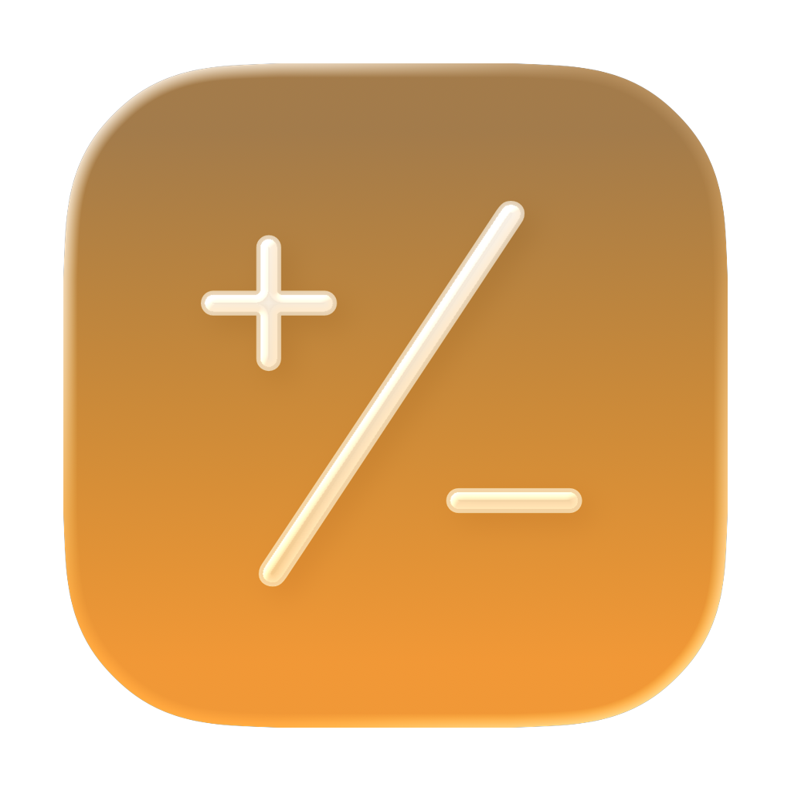
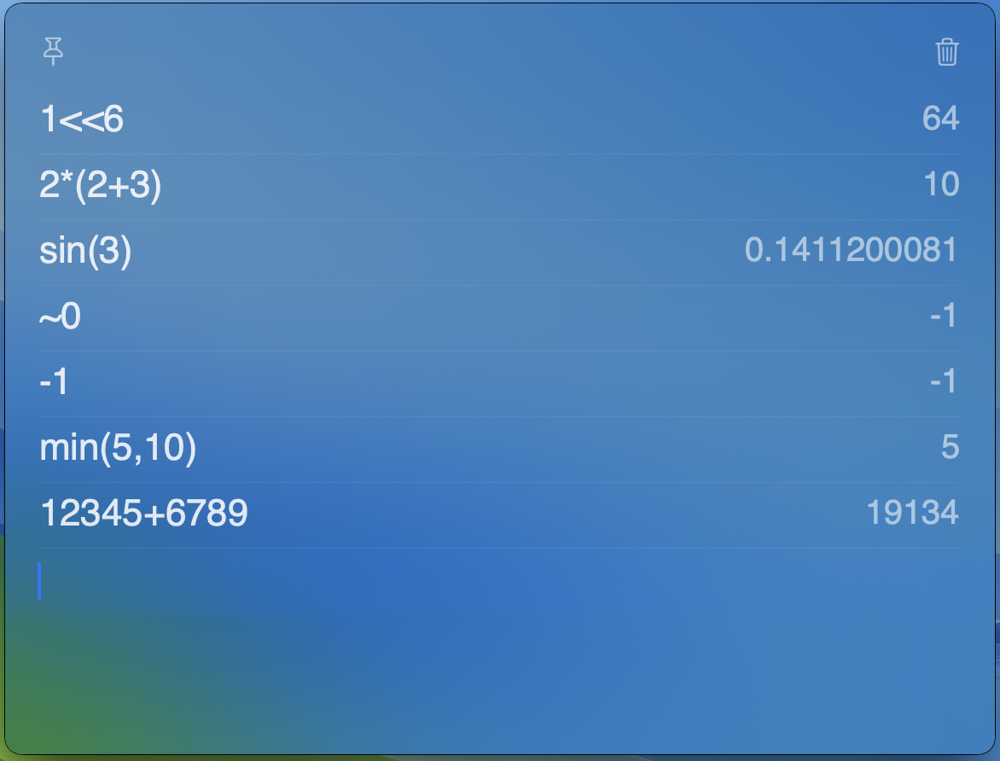

<p align="center">
  
</p>

<h1 align="center">CalcSheet</h1>

<p align="center">
  一个常驻菜单栏的极简计算器 —— 像便签纸一样随手算。
</p>

<p align="center">
  <a href="https://github.com/chenwbyx/CalcSheet/releases"></a>
  
  
  <a href="LICENSE"></a>
</p>

<p align="center">
  <a href="README.md">English</a> ·
  <a href="README.zh-CN.md">中文</a>
</p>

<p align="center">
  <a href="https://github.com/chenwbyx/CalcSheet/releases">下载</a> ·
  <a href="https://github.com/chenwbyx/CalcSheet/issues">反馈问题</a>
</p>

---

## 功能亮点

- **自然输入** — 直接输入 `128 * 3.5` 或 `sqrt(144)`，边打边出结果
- **计算历史** — 每一行计算都保留在屏幕上，方便回顾
- **键盘优先** — 全局快捷键显示/隐藏，`⌘R` 清空，`⌘,` 打开设置
- **窗口置顶** — 点击图钉按钮，让窗口始终保持在最前面
- **轻量简洁** — 常驻菜单栏，没有 Dock 图标，不打扰你的工作
- **自由定制** — 调整字体大小、主题（自动/深色/浅色）等
- **自动复制** — 计算结果自动复制到剪贴板（可选）

## 支持的表达式

### 运算符

| 运算符 | 说明 | 示例 |
|--------|------|------|
| `+` `-` `*` `/` | 基本四则运算 | `128 * 3.5` |
| `%` | 取模 | `10 % 3` = 1 |
| `^` | 幂运算 | `2 ^ 10` = 1024 |
| `<<` `>>` | 位移 | `1 << 8` = 256 |
| `&` `\|` | 按位与 / 按位或 | `12 & 10` = 8 |
| `~` | 按位取反（一元） | `~0` = -1 |
| `()` | 括号 | `(1 + 2) * 3` |

### 函数

| 分类 | 函数 |
|------|------|
| 取整 | `abs`, `ceil`, `floor`, `round`, `trunc`, `sign` |
| 开方 | `sqrt`, `cbrt` |
| 指数 | `exp`, `log` (ln), `ln`, `log2`, `log10` |
| 三角函数 | `sin`, `cos`, `tan`, `asin`, `acos`, `atan` |
| 双曲函数 | `sinh`, `cosh`, `tanh` |
| 多参数 | `max`, `min`, `pow`, `hypot` |

### 常量

`pi`, `e`, `ln2`, `ln10`, `log2e`, `log10e`, `sqrt2`, `sqrt1_2`

## 截图

<p align="center">
  
</p>

## 安装

从 [GitHub Releases](https://github.com/chenwbyx/CalcSheet/releases) 下载最新版本，打开 `.dmg`，将 **CalcSheet** 拖入应用程序文件夹。

### 从源码编译

需要 macOS 15+ 和 Xcode 16+。

```bash
git clone https://github.com/chenwbyx/CalcSheet.git
cd CalcSheet
xcodebuild -project CalcSheet.xcodeproj -scheme CalcSheet -configuration Release build
```

## 技术栈

- **Swift** + **SwiftUI**
- macOS 15+
- [KeyboardShortcuts](https://github.com/sindresorhus/KeyboardShortcuts) by @sindresorhus

## 开源协议

[MIT](LICENSE) © 2026 xiaobo.chen
